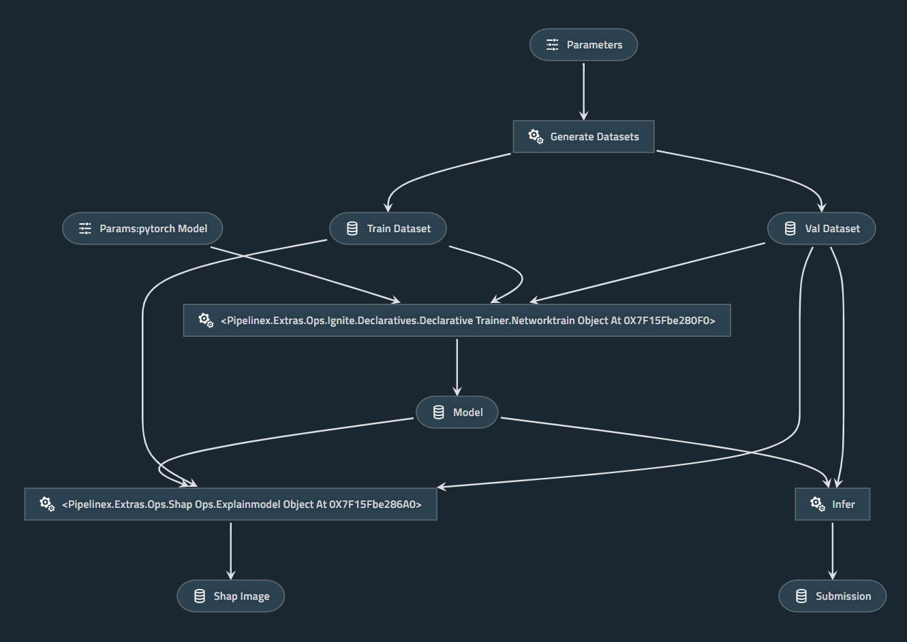

# PipelineX PyTorch

An example project using [PipelineX](https://github.com/Minyus/pipelinex), Kedro, PyTorch, Ignite, and SHAP for image classification

<p align="center">

Pipeline visualized by Kedro-viz
</p>

## 1. Install dependencies

```bash
$ pip install pipelinex torch torchvision pytorch-ignite kedro shap mlflow kedro-viz
```

Note: `mlflow` and `kedro-viz` are optional.

## 2. Clone this repository and run `main.py`

```bash
$ git clone https://github.com/Minyus/pipelinex_pytorch.git
$ cd pipelinex_pytorch
$ python main.py
```

## Tested environment

- Python 3.6.8
